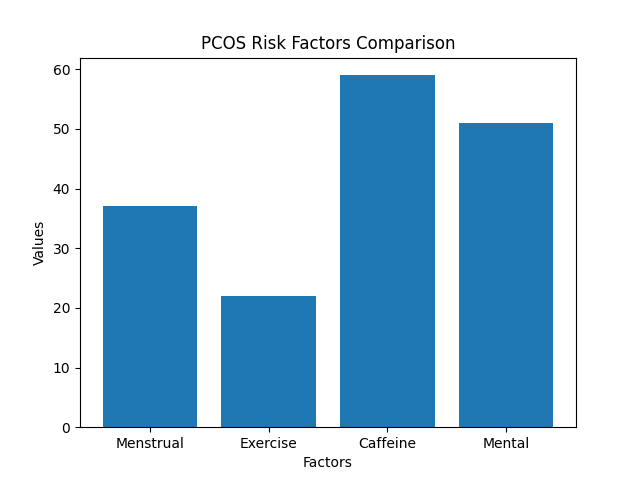
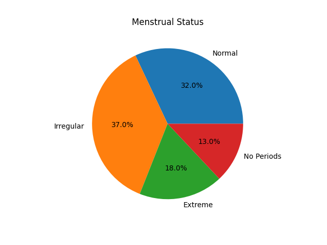
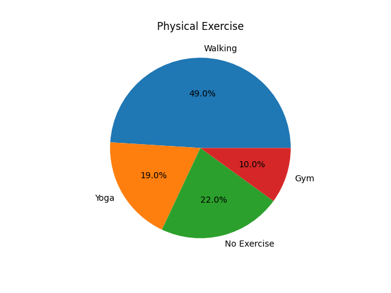
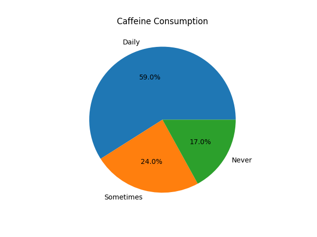
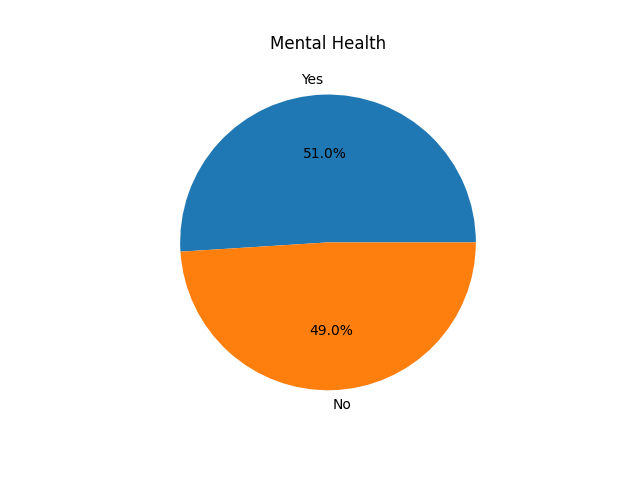

# PCOS Multi-Factor Lifestyle Analysis
## 🔍 Key Insights

- Irregular menstrual cycles are the most common issue among participants.
- A significant number of individuals have low physical activity.
- Daily caffeine intake is high, which may impact hormonal balance.
- Mental health issues are present in nearly half of the cases.
## 📊 Interpretation of Results

The analysis shows that:

- Caffeine intake is the highest contributing lifestyle factor.
- Mental health concerns are also significantly high.
- Lack of exercise appears in a notable portion of participants.
- Menstrual irregularities remain a key clinical indicator of PCOS.

This suggests that both lifestyle and physiological factors play a role in PCOS.
## 📈 Visualizations

### PCOS Risk Comparison

### Menstrual Cycle Analysis

### Exercise Levels

### Caffeine Intake

### Mental Health

## 📌 Key Finding

Lifestyle factors such as caffeine consumption and mental health may have a stronger association with PCOS patterns than expected.